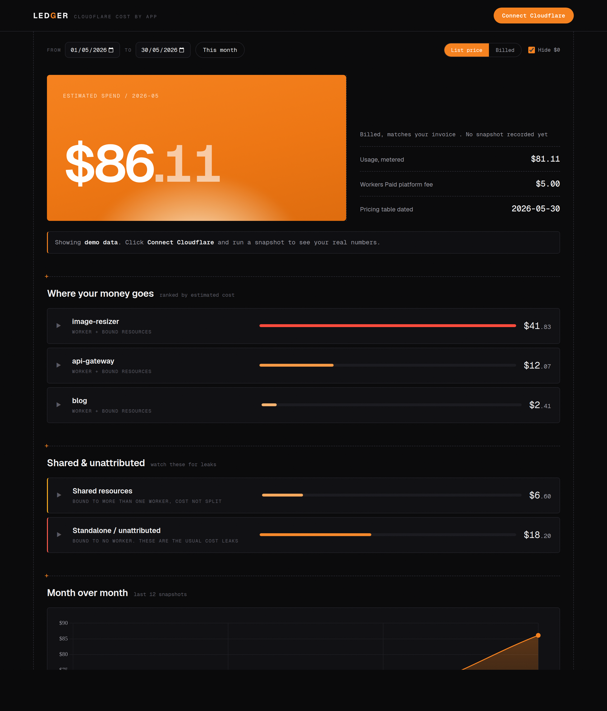
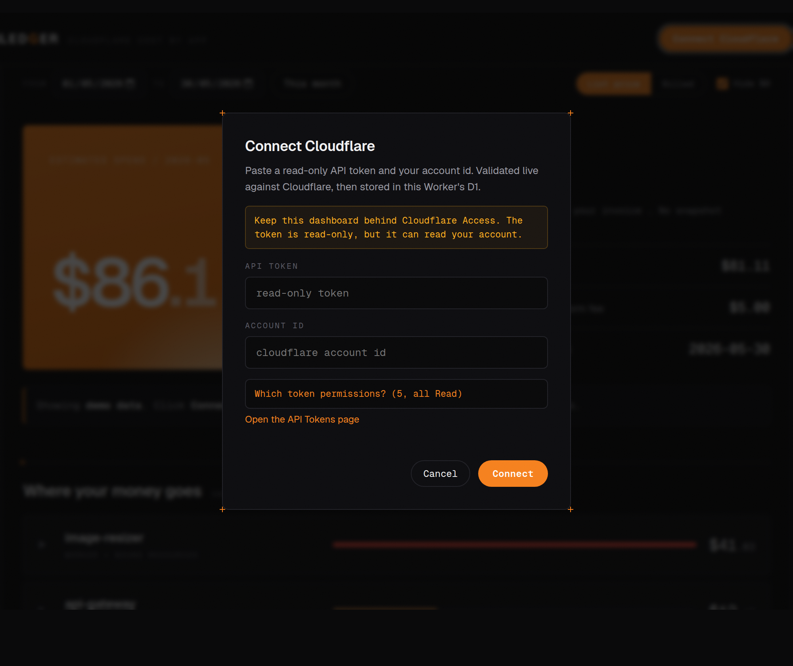

# cf-ledger

A self-hosted Cloudflare Worker that answers one question the Cloudflare
dashboard refuses to: **which of my applications is costing me money?**

It snapshots your account's usage daily, attributes it **per application** in
**real dollars**, and serves an HTML dashboard behind Cloudflare Access.



<sub>Sample data. Per-app dollar costs, ranked, with a shared / unattributed section for the cost leaks.</sub>

## Just want to see your costs?

Use the hosted version, no install: **[cf-ledger.klappe.dev](https://cf-ledger.klappe.dev)**.
Paste a read-only API token; it stays in your browser and is never stored on the
server. It's stateless (zero setup, but no saved history). How it works:
[below](#how-the-hosted-version-works).

## Run your own

For an always-on instance with saved month-over-month history, host it yourself.
Both options below use the normal stored-token mode:

- **[Deploy to Cloudflare](#launch-it-on-cloudflare)** — always-on, daily
  snapshots, behind a Cloudflare Access login.
- **[Run it locally](#run-it-locally)** — fully private, nothing deployed, your
  token and data never leave your machine.

## Launch it on Cloudflare

[](https://deploy.workers.cloudflare.com/?url=https://github.com/dennisklappe/cf-ledger)

Three steps, no terminal required:

1. **Deploy.** Click the button. Cloudflare clones the repo, creates the Worker
   and its D1 database, and deploys. The Worker creates its own database tables
   on first load, so there is nothing to run by hand.
2. **Put a login in front of it (required).** Use **Cloudflare Access** (Zero
   Trust), the built-in login wall. See [Authentication](#authentication) just
   below. Until you do this, the dashboard shows a loud "not protected" warning.
3. **Connect.** Open the dashboard, click **Connect Cloudflare**, paste a
   read-only API token and your account id. It validates them live, stores them,
   then automatically backfills the last 30 days so your current month appears
   right away.

Connecting takes one paste, with the exact read-only permissions spelled out:



Prefer the CLI? See [Manual setup](#manual-setup) below.

## Authentication

The dashboard exposes your cost data and holds a token that can read your
account, so a deployed instance must sit behind a login. Use **Cloudflare
Access**, which puts a login wall at the edge with no passwords stored by this
app. Login options:

- **Email one-time PIN**: built in, zero setup. Cloudflare emails a code to the
  addresses you allow. Simplest, and the default below.
- **Google, GitHub, Microsoft, Okta, or any SAML/OIDC provider**: also
  supported, but each is an identity provider you add first under Zero Trust ->
  Integrations -> Identity providers. (GitHub works without a GitHub org.)

1. Cloudflare dashboard, **Zero Trust** -> **Access** -> **Applications** ->
   **Add an application** -> **Self-hosted**.
2. Point it at the Worker's hostname (your `*.workers.dev` URL or custom domain).
3. Add a policy, e.g. **Allow** when **Emails** is your address. Save.

Now visiting the dashboard requires that login.

**Fail-closed backstop (recommended).** A Worker also answers on its public
`*.workers.dev` URL, which can dodge a policy set only on a custom domain. Set
two variables so the Worker verifies the Access token itself and returns 403
without a valid login, everywhere:

```bash
npx wrangler secret put ACCESS_TEAM_DOMAIN   # e.g. yourteam.cloudflareaccess.com
npx wrangler secret put ACCESS_AUD           # the Access application's AUD tag
```

The AUD tag is on the Access application's **Overview**. Local development is
exempt (localhost is already private), so the warning never shows there.

## Why this exists

Cloudflare bills per **account** and per **service**, never per project. The
billing page shows subscriptions and aggregate usage, but it will not tell you
"the image-resizer Worker cost you $41 this month." This tool does, by reading
the GraphQL Analytics API and mapping every resource back to the Worker that
uses it.

## How the dollars are honest

Free allowances on Workers Paid (the 10M free requests, 10GB free R2, etc.) are
**account-wide, not per-app**. So you cannot apply a free tier to each app
separately without undercounting. For every metric this tool:

1. sums usage across all resources to get the account total,
2. subtracts the account-wide free allowance to get the **billable** cost,
3. allocates that billable cost to apps in proportion to their usage share.

The result: per-app dollars that **sum to your actual bill**, plus the flat $5
Workers Paid platform fee. The test suite enforces this invariant.

## What counts as an "application"

An app is a **Worker** plus the resources **bound** to it (read from each
Worker's bindings):

- A resource bound to **one** Worker -> its cost goes to that app.
- A resource bound to **several** Workers -> shown under **Shared**, not split.
- A resource bound to **no** Worker -> shown under **Standalone / unattributed**.
  These orphans (a forgotten R2 bucket, a legacy KV namespace) are the classic
  "where is this cost coming from" culprits, so they get their own section.

## Coverage (v1)

| Service | Metrics priced | Source |
| --- | --- | --- |
| Workers | requests, CPU time | GraphQL `workersInvocationsAdaptive` |
| KV | reads, writes, deletes, lists | GraphQL `kvOperationsAdaptiveGroups` |
| R2 | Class A / Class B ops, storage | GraphQL `r2*AdaptiveGroups` |
| D1 | rows read, rows written, storage | GraphQL + REST (`file_size`) |

**Roadmap:** Pages Functions, Durable Objects, Queues, Images, Stream,
Workers AI.

### Accuracy caveats (read these)

These are estimates from analytics, **not an invoice**:

- **Workers CPU** is estimated as `requests * median CPU time` (the adaptive
  dataset exposes quantiles, not a sum). Good for ranking, approximate in
  absolute terms.
- **Storage (GB-month)** is sampled once per day and averaged over the month.
  Early in a month it has few samples.
- **KV storage** has no reliable per-namespace API metric, so it is usually
  absent; missing metrics are surfaced, never silently counted as $0.
- Update `src/cost/pricing.ts` (`AS_OF` constant) when Cloudflare changes
  prices.

## Manual setup

For when you would rather use the CLI than the Deploy button.

Prerequisites: Node 18+, a Cloudflare account on the **Workers Paid** plan.

```bash
git clone <your-fork> cf-ledger && cd cf-ledger
npm install
npx wrangler login
```

**1. Create a read-only API token.** Dashboard, My Profile, API Tokens, Create
Token, Custom token. Add these five **Account** permission groups, each set to
**Read**: Account Analytics, Workers Scripts, Workers KV Storage, Workers R2
Storage, D1. Ignore every other "Workers" row and all Zone permissions, and set
Account Resources to include your account.

**2. Create the history database** and paste the printed id into
`wrangler.jsonc` (`d1_databases[0].database_id`):

```bash
npx wrangler d1 create cf_ledger
```

The Worker creates its tables on first run, so `db:init` is optional. Run
`npm run db:init:remote` only if you want them created ahead of time.

**3. Deploy:**

```bash
npm run deploy
```

**4. Protect the route with Cloudflare Access.** In the dashboard:
Zero Trust -> Access -> Applications -> Add a self-hosted app pointing at your
`*.workers.dev` (or custom) hostname, and add a policy allowing your email.
**This is required, not optional:** the dashboard can hold a token that reads
your account, so it must not be publicly reachable.

**5. Connect your account.** Two ways:

- **In the dashboard (recommended):** open the deployed URL and click
  **Connect Cloudflare**. Paste the token from step 1 and your account id. It is
  validated live against Cloudflare and stored in the Worker's D1. No CLI needed.
- **Or via secrets:** `npx wrangler secret put CF_API_TOKEN` and
  `npx wrangler secret put CF_ACCOUNT_ID`. Secrets are used as a fallback when
  nothing is connected through the UI.

**6. Get data.** The daily cron snapshots automatically at 03:17 UTC, or hit
**Refresh** in the UI (calls `POST /api/refresh`) to snapshot immediately.

## Run it locally

You do not have to deploy this. It runs perfectly on your own machine, which is
the most private option: nothing is published, there is no public URL, and your
API token and cost data stay in a local database on disk. Because it is only
reachable at `localhost`, you do not need Cloudflare Access either.

```bash
git clone https://github.com/dennisklappe/cf-ledger && cd cf-ledger
npm install
npm run db:init        # create the local snapshot database
npm run dev            # http://localhost:8787
```

Open `http://localhost:8787`, click **Connect Cloudflare**, paste a read-only
token + account id (see [Authentication](#authentication) for the exact
permissions), and hit **Refresh**. It still queries the real Cloudflare
Analytics API, so you get your real numbers; only the snapshots are stored
locally.

One difference from a deployed instance: the **daily automatic snapshot (cron)
only runs on a deployed Worker**, not in local dev. Locally you click **Refresh**
when you want fresh data (it backfills the last 30 days each time). Before any
snapshot exists, the dashboard shows **demo data** so you can see the layout.

For contributors:

```bash
npm test               # unit tests for the cost math and attribution
npm run typecheck
```

## How the hosted version works

[cf-ledger.klappe.dev](https://cf-ledger.klappe.dev) runs this same Worker in a
stateless mode (the `MODE=byo` var) for people who don't want to deploy anything:

- No storage, no Access. Your token + account id stay in your browser
  (`localStorage`), are sent as headers per request, used to query Cloudflare
  live, and never stored or logged on the server.
- Stateless, so no history (no month-over-month chart), just the live current
  window (up to ~31 days).
- Honest note: Cloudflare's API has no browser CORS, so the token passes through
  the Worker on each request, transit, not storage. If you'd rather it never
  touch someone else's server, run your own (above), that's the normal mode.

## Updating

The Deploy button puts a *copy* of this repo in your own Git account with
Workers Builds auto-deploy, but it does not track this upstream repo
automatically. Three ways to pull in new releases, easiest first:

1. **The included GitHub Action (one click).** This repo ships a
   `Sync from upstream` workflow (`.github/workflows/sync-upstream.yml`). In your
   copy, open the **Actions** tab and click **Run workflow**, or let it run on
   its weekly schedule. It fast-forwards from upstream and pushes, and Workers
   Builds redeploys. If your copy has diverged, it skips safely (use option 3).
2. **GitHub "Sync fork"**, if your copy is a fork: one click on the repo page.
3. **Manual**, for a customized / diverged copy:

   ```bash
   git remote add upstream https://github.com/dennisklappe/cf-ledger.git
   git pull upstream main      # resolve any conflicts
   git push                    # Workers Builds redeploys
   ```

Running locally? Just `git pull` and restart `npm run dev`.

Updates are safe for your data: the Worker creates any new tables on first run
(`CREATE TABLE IF NOT EXISTS`), and your stored snapshots and connected
credentials live in your D1, which updates never overwrite.

## API

| Route | Description |
| --- | --- |
| `GET /api/costs?month=YYYY-MM` | full per-app cost report for a month |
| `GET /api/trends` | month-over-month totals (last 12) |
| `GET /api/months` | months that have data |
| `GET /api/status` | connection status (masked account id) |
| `POST /api/connect` | validate + store a token/account id (UI login) |
| `POST /api/disconnect` | clear UI-stored credentials |
| `POST /api/refresh?days=N` | snapshot now (backfills last 30 days by default) |

## Architecture

```
src/
  index.ts              router + scheduled (cron) handler
  config.ts             UI "Connect" flow: validate + store credentials in D1
  collect.ts            fuse REST inventory + GraphQL usage into a day snapshot
  cloudflare/graphql.ts usage queries (fail-soft per dataset)
  cloudflare/rest.ts    inventory + the Worker->resource binding graph
  cost/pricing.ts       dated pricing table + per-metric cost
  cost/attribute.ts     account-wide free-tier allocation -> per-app dollars
  db/schema.sql         daily snapshot store
  db/snapshots.ts       write snapshots, roll days up into monthly usage
public/                 the dashboard (static, served via the ASSETS binding)
```

## Troubleshooting

**Deploy button shows `HTTP 400` at the project name / repo step.** The button
creates a git-connected Worker, which needs a live Cloudflare-to-GitHub
authorization to create the repository. The most common cause is an **expired
GitHub authorization** (error `8000121`: "Your GitHub authorization has
expired"). The app can still look installed at
[github.com/settings/installations](https://github.com/settings/installations)
and your existing projects keep deploying, while creating a new repo fails,
because the underlying OAuth has gone stale. To see the exact reason, open the
browser Network tab, click the failed `POST .../pages/connections/github/.../repos`
(status 400), and read the Response.

Fixes, easiest first:

- **Reinstall the Cloudflare GitHub App** to refresh the authorization, per
  Cloudflare's guide:
  [Reinstall the Cloudflare GitHub App](https://developers.cloudflare.com/pages/configuration/git-integration/github-integration/#reinstall-the-cloudflare-github-app).
  Then retry the button. **Caution:** that app is shared across all your Workers
  and Pages projects. Reinstalling keeps live sites serving, but you may have to
  reconnect each project's build (Settings -> Builds) to resume auto-deploy. If
  you have many projects, prefer one of the next two options instead.
- Or **uncheck "Create private Git repository"** in the deploy form.
- Or skip the button entirely: deploy from the CLI ([Manual setup](#manual-setup))
  -- no GitHub App involved -- or connect this repo via **Workers & Pages ->
  Import a repository**.

This is an account-level GitHub-integration issue, not a problem with this repo.

**"Not protected" warning on the deployed dashboard.** It means the Worker has
no login in front of it. See [Authentication](#authentication) and add a
Cloudflare Access policy. Local development never shows this.

**Costs read $0 or empty after connecting.** Click **Refresh** to take the first
snapshot (it backfills the last 30 days). The dashboard only shows data it has
snapshotted; there is none until the first refresh or the daily cron runs.

## License

MIT. See [LICENSE](LICENSE).
